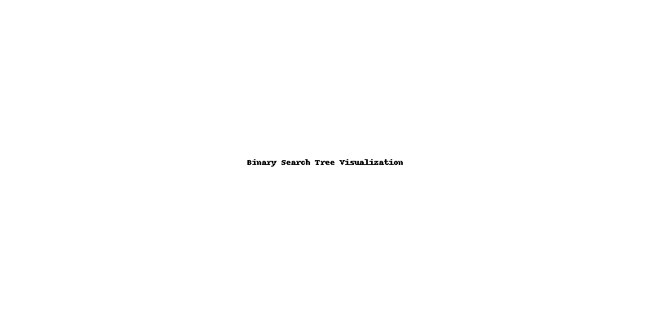
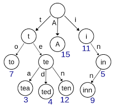
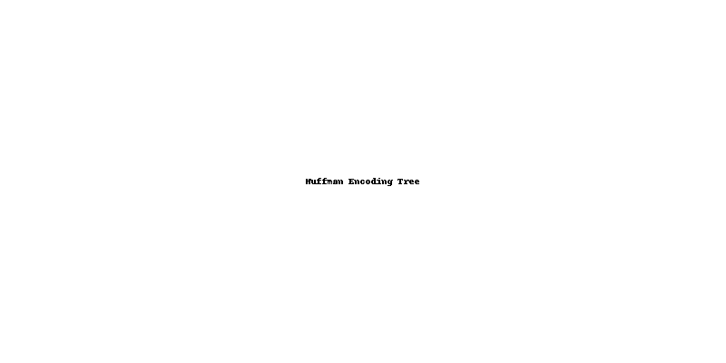

# Portfolio

## 📌 Overview

This portfolio consists of C, C++, and Python projects that showcase my understanding of:

- Low-level coding concepts: memory management, pointer arithmetic, and multi-threading.
- Higher-level concepts: algorithms, problem decomposition, and complex data structures.

I’ve selected a few key projects to highlight these concepts:

1. **Snake** – Demonstrates memory management in C.
2. **Dynamic Memory Allocation and Leak Sanitzer** - Implementation of dynamic memory calls with advanced leak sanitzer.
3. **Inklings** – A multi-threaded simulation using mutexes.
4. **Shell** – A custom shell implementation mimicking basic UNIX behavior.
5. **Data Structures** (Folder): **Binary Search Tree**, **Hash Table**, and **Trie**.
6. **Algorithms** (Folder): **Convex Hull**, **Huffman Encoding**, and **Image Seam Carving**.

Each project includes a short overview, the skills demonstrated, and clear compilation instructions.

---

## 🐍 Snake

### 🔹 Overview
**Snake** is a fully functional recreation of the classic Snake game, written in C. It features:

- A customizable board using RLE encoding.
- Dynamic memory allocation and pointer arithmetic for game state updates.
- Robust memory management to avoid leaks, double frees, and use-after-free errors.

### 🔹 Skills Demonstrated
- Dynamic memory allocation (`malloc`, `free`)
- Edge case handling
- Debugging memory leaks and segmentation faults

### 🔹 How to Compile
```bash
./unit_test.sh
```

---

## Dynamic Memory Allocation and Leak Sanitzer

### 🔹 Overview
Implemented malloc and free calls accompanied with advanced leak sanizter that can catch a number of errors like invalid free, use after free, not in heap, overflows, etc.

### 🔹 Skills Demonstrated
- Heap memory  management through construction and destruction of allocated blocks.
- Catches memory safety issues that could have serious implications in case of segfaults and overflows.
- Efficient use of C++ structures like unordered sets, leading to 500,000 malloc calls being ran in a few seconds or less.

### 🔹 How to Compile

Run the test suite, highlighted by 40 tests named test???.cc;
```bash
make check
```

## 🎨 Inklings

### 🔹 Overview
**Inklings** is a multi-threaded C application that simulates autonomous agents—called "inklings"—moving on a grid. Each inkling:

- Is assigned a color: **Red**, **Green**, or **Blue**
- Competes for a shared, limited resource of their respective color
- Operates concurrently with other inklings via **POSIX threads**

### 🔹 Skills Demonstrated
- Thread creation using `pthread`
- Mutex-based synchronization for shared resource management
- Deadlock avoidance and thread-safe programming
- Debugging concurrency issues in a multi-threaded environment

### 🔹 How to Compile
```bash
./unit_test.sh
```

---

## ⚖️ Shell

### 🔹 Overview
**Shell** is a minimalistic custom shell interpreter written in C. It supports:

- Running basic UNIX commands
- Built-in command handling for `cd`, `exit`, etc.
- Simple piping and redirection

### 🔹 Skills Demonstrated
- Process creation and management with `fork()` and `exec()`
- File descriptor manipulation
- Parsing command-line input

### 🔹 How to Compile
```bash
./412_shell
```

---

## 🧰 Data Structures

### 🌳 Binary Search Tree
- Implementation of insertion, deletion, search, and in-order traversal
- Memory-managed pointer-based tree
- Balanced and unbalanced operations shown

**Image Example:**


### 🔹 Skills Demonstrated
- Recursive data structure manipulation
- Memory management in trees

---

### 🔑 Hash Table
- Custom hash function
- Collision resolution via chaining
- Resizing logic for dynamic loads

**Image Example:**


### 🔹 Skills Demonstrated
- Pointer arrays
- Hashing algorithms
- Linked lists for chaining

---

### 🧵 Trie
- Prefix tree for string search
- Insert, search, and delete operations
- Ideal for autocomplete features

**Image Example:**


### 🔹 Skills Demonstrated
- Tree traversal
- Character-indexed storage
- Efficient search structure

---

## ⚖️ Algorithms

### 🔸 Convex Hull (Divide and Conquer)
- Implementation of Graham Scan
- Handles edge cases in sorting and orientation

**Image Example:**


### 🔹 Skills Demonstrated
- Geometry algorithms
- Sorting, angle measurement, and stack usage

---

### 🎨 Huffman Encoding
- Lossless compression algorithm
- Binary tree creation and traversal
- Character frequency analysis

**Image Example:**


### 🔹 Skills Demonstrated
- Priority queues
- Binary tree traversal
- Bit manipulation

---

### 🌄 Image Seam Carving
- Content-aware image resizing
- Dynamic programming to find low-energy paths
- Seam insertion and removal

**Image Example:**


### 🔹 Skills Demonstrated
- Energy map computation
- DP path tracking
- Image buffer manipulation

---

