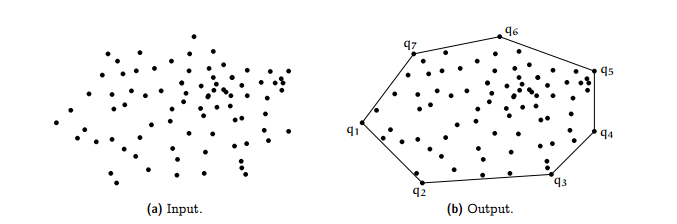

# Portfolio

## Who Am I?

A 22 year-old student of tech who fell in love with low-level computer architecture throughout my Bachelor of Science undergrad in CS. Computers, to me, are complex and misunderstood puzzles that carry infinite solutions to complex problems like health-care, automotive saftey, complex data analysis, while also providing means of entertainment through art desing softwares, music recording software, and video games. Computers are almost begging us to create complex solutions to problemss that require near speed of light calculations to complete in a reasonbale time, and I would argue this has been humanities greatest gift, a gift I am going to use.

## 📌 Overview

This portfolio consists of C, C++, and Python projects that showcase my understanding of:

- Low-level coding concepts: memory management, pointer arithmetic, and multi-threading.
- Higher-level concepts: algorithms, problem decomposition, and complex data structures.

I’ve selected a few key projects to highlight these concepts:

1. **Snake** – Demonstrates memory management in C.
2. **Dynamic Memory Allocation and Leak Sanitzer** - Implementation of dynamic memory calls with advanced leak sanitzer.
3. **Inklings** – A multi-threaded simulation using mutexes.
4. **Shell** – A custom shell implementation mimicking basic UNIX behavior.
5. **Data Structures** (Folder): **Binary Search Tree**, **Hash Table**, and **Trie**.
6. **Algorithms** (Folder): **Convex Hull**, **Huffman Encoding**, and **Image Seam Carving**.

Each project includes a short overview, the skills demonstrated, and clear compilation instructions.

---

## 🐍 Snake

### 🔹 Overview
**Snake** is a fully functional recreation of the classic Snake game, written in C. It features:

- A customizable board using RLE encoding.
- Dynamic memory allocation and pointer arithmetic for game state updates.
- Robust memory management to avoid leaks, double frees, and use-after-free errors.

### 🔹 Skills Demonstrated
- Dynamic memory allocation (`malloc`, `free`)
- Edge case handling
- Debugging memory leaks and segmentation faults

### 🔹 How to Compile
```bash
./unit_test.sh
```

---

## Dynamic Memory Allocation and Leak Sanitzer

### 🔹 Overview
Implemented malloc and free calls accompanied with advanced leak sanizter that can catch a number of errors like invalid free, use after free, not in heap, overflows, etc.

### 🔹 Skills Demonstrated
- Heap memory  management through construction and destruction of allocated blocks.
- Catches memory safety issues that could have serious implications in case of segfaults and overflows.
- Efficient use of C++ structures like unordered sets, leading to 500,000 malloc calls being ran in a few seconds or less.

### 🔹 How to Compile

Run the test suite, highlighted by 40 tests named test???.cc;
```bash
make check
```

## 🎨 Inklings

### 🔹 Overview
**Inklings** is a multi-threaded C application that simulates autonomous agents—called "inklings"—moving on a grid. Each inkling:

- Is assigned a color: **Red**, **Green**, or **Blue**
- Competes for a shared, limited resource of their respective color
- Operates concurrently with other inklings via **POSIX threads**

### 🔹 Skills Demonstrated
- Thread creation using `pthread`
- Mutex-based synchronization for shared resource management
- Deadlock avoidance and thread-safe programming
- Debugging concurrency issues in a multi-threaded environment

### 🔹 How to Compile
```bash
./unit_test.sh
```

---

## ⚖️ Shell

### 🔹 Overview
**Shell** is a minimalistic custom shell interpreter written in C and C++. It supports:

- Running basic UNIX commands
- Built-in command handling for `tee`, `pwd`, `head`, `tail`, and `wc`
- Simple piping and redirection

### 🔹 Skills Demonstrated
- Process creation and management with `fork()` and `exec()`
- File descriptor manipulation
- Parsing command-line input

### 🔹 How to Compile
```bash
./412_shell
```

---

## 🧰 Data Structures

### 🌳 Binary Search Tree
- Implementation of insertion, deletion, destory, search, and preorder, inorder, postorder traversel.
- Heap allocated nodes
- Node and tree classes with public and private members. Communicate by being friend classes.

**Image Example:**


### 🔹 Skills Demonstrated
- Recursive data structure manipulation
- Memory management of nodes and tree structures

---

### 🔑 Hash Table
- Hash table construction with clash
- Collision resolution via chaining, linear probing, and double hashing.
- Resizing logic for dynamic loads
- Handles 1d and 2d hashing tables.

**Image Example:**


### 🔹 Skills Demonstrated
- Chaining, linear probing, double hashing.
- Hashing algorithms
- Dynamic table resizing.

---

### 🧵 Trie
- Prefix tree for string search
- Insert, search, delete operations, bool is_in, and descendent functions.
- Ideal for highly efficient autocomplete features

**Image Example:**


### 🔹 Skills Demonstrated
- Tree traversal
- Character-indexed storage
- Efficient search structure

---

## ⚖️ Algorithms

### 🔸 Convex Hull (Divide and Conquer)
- Triangles clockwise and counter-clockwise data manipulation to find outer edges.
- Handles edge cases in sorting and orientation

**Image Example:**


### 🔹 Skills Demonstrated
- Geometry algorithms
- Sorting, angle measurement, and stack usage

---

### 🎨 Huffman Encoding
- Lossless compression algorithm
- Min heap manipulation
- Character frequency analysis

**Image Example:**


### 🔹 Skills Demonstrated
- Priority queues
- Bit manipulation

---

### 🌄 Image Seam Carving
- Content-aware image resizing
- Dynamic programming to find low-energy paths
- Seam insertion and removal

**Image Example:**


### 🔹 Skills Demonstrated
- Energy map computation
- DP path tracking
- Image buffer manipulation

---

